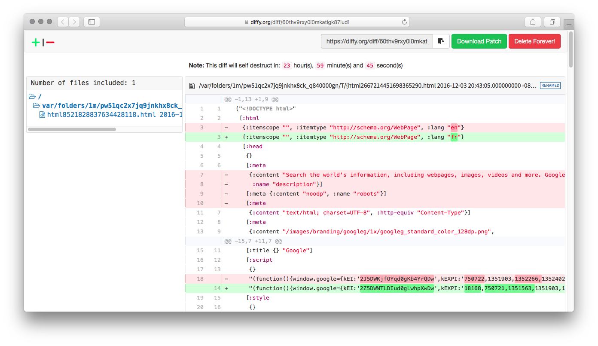

# html-diff
Show a visual diff of two HTML pages, based on their Hiccup representations

## Installation

Install Inlein: http://inlein.org/#install

## Usage

`./html-diff http://www.google.com/ http://www.google.fr/`

Also works with local files:

`./html-diff ./1.html ./2.html`

## Picture

## Todo

- Exit after launching the diff program
